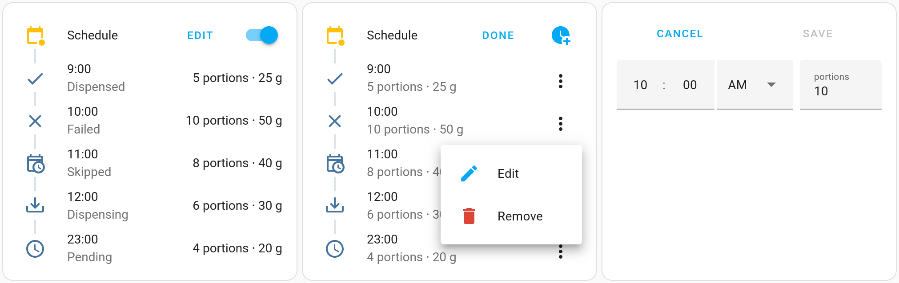

# Dispenser Schedule Card

> A very simple card to view and control dispenser schedules for the 
> [Home Assistant](https://www.home-assistant.io/) Lovelace / Grace UI


[](https://github.com/hacs/integration)




## Installation

### Using HACS

You can add this repository as a custom HACS repo by following the official guide:
https://hacs.xyz/docs/faq/custom_repositories/

### Manually

Download `dispenser-schedule-card.min.js` from the Releases tab of this repository and place it in under your `www` folder, then add this as a dashboard, by following the official HA guide: https://developers.home-assistant.io/docs/frontend/custom-ui/registering-resources

## Usage

Typical YAML:

```yaml
type: custom:dispenser-schedule-card
entity: sensor.feeder_raw_feed_plan
switch: switch.feeder_feeding_schedule
actions:
  add: esphome.feeder_add_scheduled_feed
  edit: esphome.feeder_edit_scheduled_feed
  remove: esphome.feeder_remove_scheduled_feed
alternate_unit:
  unit_of_measurement: g
  conversion_factor: 5
  approximate: true
```

### Options

|  Name                 |   Required   | Description                                                                                                                             |
|-----------------------|--------------|-----------------------------------------------------------------------------------------------------------------------------------------|
| `entity`              | **Required** | An entity_id in the `sensor` domain containing the schedule                                                                             |
| `switch`              |  *Optional*  | An entity_id in the `switch` domain containing the on/off toggle for the schedule.                                                      |
| `actions`             |  *Optional*  | `add`, `edit`, and `remove` actions                                                                                                     |
| `editable`            |  *Optional*  | Whether the schedule is editable. `always`, `toggle`, or `never`.<br><br> Default `toggle` if `actions` are defined, otherwise `never`. |
| `unit_of_measurement` |  *Optional*  | Optional override for the unit label. <br><br> Default `portions`.                                                                      |
| `alternate_unit`      |  *Optional*  | Configuration to display a secondary unit of measurement, with a conversion factor.                                                     |

#### `actions` options
|  Name    |  Required  | Description                                             |
|----------|------------|-----------------------------------------------------------|
| `add`    | *Optional* | action_id that accepts `id`, `hour`, `minute`, `portions` |
| `edit`   | *Optional* | action_id that accepts `id`, `hour`, `minute`, `portions` |
| `remove` | *Optional* | action_id that accepts `id`                               |

#### `alternate_unit` options

|  Name                 |   Required   | Description                                                                    |
|-----------------------|--------------|--------------------------------------------------------------------------------|
| `unit_of_measurement` | **Required** | Label for the secondary unit of measurement                                    |
| `conversion_factor`   | **Required** | Number to multiply the primary amount by                                       |
| `approximate`         |  *Optional*  | Whether the alternate unit is an approximation. Adds a `~` prefix to the value |


## Compatibility

This card was created for the Xiaomi Smart Pet Feeder running 
[esphome-miot](https://github.com/dhewg/esphome-miot/pull/17),
but support for other types of dispensers may be added if enough is known
about the structure. Please open an issue including as much detail as possible.

`entity` state currently must be contain a string with the the structure
`[int id],[int hour],[int minute],[int amount],[int status]`, as a 
comma-separated list, where `id` is the entry index, `hour` is the 23h formatted
hour at which to dispense, `minute` is the minute of the hour at which to dispense, `amount`
is the amount to dispense (portions, grams, etc) and `status` is an 
integer with the following meaning:
 -   0 - dispensed successfully for today
 -   1 - dispense failed for today (lack of food, food stuck, etc)
 - 254 - currently dispensing
 - 255 - pending for today

Example:

`0,10,30,5,0,1,12,0,10,255`

- entry 0: 10:30 dispense 5 portions, dispensed successfully.
- entry 1: 12:00 dispense 10 portions, pending.

`skipped` is assumed when the entry is still `pending` but the current time is
greater than the dispense time.

A customizable option using Jinja2 templates to extract the schedule from
arbitrary entities is also under consideration.


## Languages

Translations are currently available for the following languages:

- English
- Français (French)
- Italiano (Italian)
- Română (Romanian)
- Türkçe (Turkish)

Contributions are welcome!