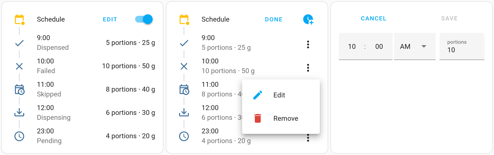

# Dispenser Schedule Card

> A very simple card to view and control dispenser schedules for the
> [Home Assistant](https://www.home-assistant.io/) Lovelace / Grace UI

[](https://github.com/hacs/integration)



## Installation

### Using HACS

[](https://my.home-assistant.io/redirect/hacs_repository/?owner=cristianchelu&repository=dispenser-schedule-card&category=plugin)

Or follow these steps:

1. Open HACS (Home Assistant Community Store)
2. Click on the three dots in the top right corner
3. Click on `Custom repositories`
4. In the Repository field, enter https://github.com/cristianchelu/dispenser-schedule-card/
5. In the Category field, select `Dashboard`
6. Click on `Add`
7. Search for `Dispenser Schedule Card` in the list
8. Install the card

More information and screenshots in the official guide:
https://hacs.xyz/docs/faq/custom_repositories/

### Manually

Download `dispenser-schedule-card.min.js` from the Releases tab of this
repository and place it in under your `www` folder, then add this as resource
type "Javascript Module", by following the official HA guide:
https://developers.home-assistant.io/docs/frontend/custom-ui/registering-resources

## Usage

Typical YAML:

```yaml
type: custom:dispenser-schedule-card
device:
  type: xiaomi-smart-feeder
  entity: sensor.feeder_raw_feed_plan
  switch: switch.feeder_feeding_schedule
  actions:
    add: esphome.feeder_add_scheduled_feed
    edit: esphome.feeder_edit_scheduled_feed
    remove: esphome.feeder_remove_scheduled_feed
alternate_unit:
  unit_of_measurement: g
  conversion_factor: 5
  approximate: true
```

### Options

| Name                  | Required     | Description                                                                                                                                                 |
| --------------------- | ------------ | ----------------------------------------------------------------------------------------------------------------------------------------------------------- |
| `device`              | **Required** | Device block. Must include `type`: `xiaomi-smart-feeder`, `xiaomi-smart-feeder-2`, `petlibro`, or `custom`. See [Device](#device).                          |
| `editable`            | _Optional_   | Whether the schedule is editable. `always`, `toggle`, or `never`.<br><br> Default `toggle` when the device supports editing or toggling; otherwise `never`. |
| `unit_of_measurement` | _Optional_   | Unit label. String or object with plural forms. See [Pluralization](#pluralization). <br><br> Default `portions`.                                           |
| `alternate_unit`      | _Optional_   | Configuration to display a secondary unit of measurement, with a conversion factor.                                                                         |
| `display`             | _Optional_   | See [Display customization](#display-customization)                                                                                                         |

### Device

| Name        | Required             | Description                                                                                                                                                                                                                                                                                                   |
| ----------- | -------------------- | ------------------------------------------------------------------------------------------------------------------------------------------------------------------------------------------------------------------------------------------------------------------------------------------------------------- |
| `type`      | **Required**         | `xiaomi-smart-feeder`, `xiaomi-smart-feeder-2`, `petlibro`, or `custom`.                                                                                                                                                                                                                                      |
| `entity`    | _Conditionally req._ | An entity_id in the `sensor` domain containing the schedule. Required for all types except `petlibro`, where the card picks the PetLibro `binary_sensor` with **`attributes.schedule_type: full`** (or set `entity` manually).                                                                                |
| `switch`    | _Optional_           | An entity_id in the `switch` domain for the schedule on/off toggle. Supported for `xiaomi-smart-feeder` and `custom`. For `petlibro`, defaults to the schedule `binary_sensor` + `petlibro.toggle_feeding_schedule`; optional override (string or object), see [PetLibro Dry Feeders](#petlibro-dry-feeders). |
| `actions`   | _Optional_           | `add`, `edit`, `remove`, and `toggle` (enable/disable individual entry) actions. Supported for `xiaomi-smart-feeder` and `custom`.                                                                                                                                                                            |
| `device_id` | _Conditionally req._ | Home Assistant device id used for service calls and entity auto-discovery. Required for `petlibro`.                                                                                                                                                                                                           |

For `type: custom`, additional fields are required; see [Custom Device Parsing](#custom-device-parsing). For `type: petlibro`, see [PetLibro Dry Feeders](#petlibro-dry-feeders).

#### `device.actions` options

| Name     | Required   | Description                                                  |
| -------- | ---------- | ------------------------------------------------------------ |
| `add`    | _Optional_ | action_id that accepts `id`, `hour`, `minute`, `amount` `*`. |
| `edit`   | _Optional_ | action_id that accepts `id`, `hour`, `minute`, `amount` `*`. |
| `remove` | _Optional_ | action_id that accepts `id`.                                 |
| `toggle` | _Optional_ | action_id that accepts `id`.                                 |

`*` - `portions` (legacy) is also accepted as a parameter instead of `amount`.

#### `alternate_unit` options

| Name                  | Required     | Description                                                                                    |
| --------------------- | ------------ | ---------------------------------------------------------------------------------------------- |
| `unit_of_measurement` | **Required** | Secondary unit label. String or object with plural forms. See [Pluralization](#pluralization). |
| `conversion_factor`   | **Required** | Number to multiply the primary amount by                                                       |
| `approximate`         | _Optional_   | Whether the alternate unit is an approximation. Adds a `~` prefix to the value                 |

### Pluralization

Both `unit_of_measurement` and `alternate_unit.unit_of_measurement` support
pluralization based on
[Unicode plural rules](https://www.unicode.org/cldr/charts/43/supplemental/language_plural_rules.html).

Simple string format:

```yaml
unit_of_measurement: portions
alternate_unit:
  unit_of_measurement: grams
```

Pluralization object format:

```yaml
unit_of_measurement:
  one: portion
  other: portions
alternate_unit:
  unit_of_measurement:
    one: gram
    other: grams
```

Language for which the pluralization rules apply is always the current logged in
user's language setting.

## Compatibility

Minimum Home Assistant version: **2026.4.0**.

### Xiaomi Smart Pet Feeder (`mmgg.feeder.fi1`)

This card was originally created for the Xiaomi Smart Pet Feeder running
ESPHome firmware with the [esphome-miot](https://github.com/dhewg/esphome-miot/blob/main/config/mmgg.feeder.fi1.yaml)
component and offers full support for it.

The sensor entity state follows this comma-separated format:
`[int id],[int hour],[int minute],[int amount],[int status]`

Where:

- `id` - entry index (0-9)
- `hour` - dispense hour (0-23)
- `minute` - dispense minute (0-59)
- `amount` - portions to dispense (1-30)
- `status` - current state: `0` (dispensed), `1` (failed), `254` (dispensing), `255` (pending)

Example: `0,10,30,5,0,1,12,0,10,255` represents two entries:

- Entry 0: 10:30, dispense 5 portions, already dispensed
- Entry 1: 12:00, dispense 10 portions, pending

See how this format is parsed using regex in [Custom Device Parsing](#status_pattern-details).

Feeders with the original firmware are _NOT_ currently supported as much of the
logic is not handled by the device itself.

### PetKit Feeders (Fresh Element, YumShare)

The [`homeassistant_petkit`](https://github.com/Jezza34000/homeassistant_petkit) custom integration by [@Jezza34000](https://github.com/Jezza34000) is compatible with this card.

### PetLibro Dry Feeders

Supported via the [`jjjonesjr33/petlibro`](https://github.com/jjjonesjr33/petlibro) custom integration.

**Integration contract (schedule entity):**

| Topic         | Rule                                                                                                                                                                                                                                                                                                                                                                                                                                                                                                                                                                                             |
| ------------- | ------------------------------------------------------------------------------------------------------------------------------------------------------------------------------------------------------------------------------------------------------------------------------------------------------------------------------------------------------------------------------------------------------------------------------------------------------------------------------------------------------------------------------------------------------------------------------------------------ |
| Discovery     | `binary_sensor` on the device with **`attributes.schedule_type: full`**.                                                                                                                                                                                                                                                                                                                                                                                                                                                                                                                         |
| Plans         | **`attributes.schedule`**: array of plan objects (or a map normalized by the card with `Object.values`—prefer an array from the integration).                                                                                                                                                                                                                                                                                                                                                                                                                                                    |
| `repeat_days` | **`number[]` only**, **1 = Monday … 7 = Sunday** (matches the card’s weekday model).                                                                                                                                                                                                                                                                                                                                                                                                                                                                                                             |
| Plan state    | **`state`**: `pending`, `to_be_skipped`, `dispensed`, `skipped`, `state_5`, `unknown`, `not_for_today`. Legacy **`feed_state`** is still read.                                                                                                                                                                                                                                                                                                                                                                                                                                                   |
| Services      | `petlibro.add_feeding_plan` / `edit_feeding_plan` use **`days`** as `"1"`…`"7"` strings (same convention as `repeat_days`). Per-plan **`delete_feeding_plan`** (`device_id`, `plan_id`) and **`toggle_feeding_plan`** (`device_id`, `plan_id`, `enable`) match add/edit. Whole schedule on/off: **`toggle_feeding_schedule`** (`device_id`, `enable`). **Skip today only** (does not disable the recurring plan): **`skip_feeding_plan`** (`device_id`, `plan_id`, `skip`) — requires an integration build that registers this service; skipped plans surface as **`not_for_today`** in `state`. |

Minimal YAML:

```yaml
type: custom:dispenser-schedule-card
device:
  type: petlibro
  device_id: abc123def456...
```

| Name        | Required     | Description                                                                                                                                                                                                                                                                                                                                                                                      |
| ----------- | ------------ | ------------------------------------------------------------------------------------------------------------------------------------------------------------------------------------------------------------------------------------------------------------------------------------------------------------------------------------------------------------------------------------------------ |
| `type`      | **Required** | `petlibro`.                                                                                                                                                                                                                                                                                                                                                                                      |
| `device_id` | **Required** | Home Assistant device id (service target + discovery).                                                                                                                                                                                                                                                                                                                                           |
| `entity`    | _Optional_   | Override the schedule `binary_sensor` if discovery fails.                                                                                                                                                                                                                                                                                                                                        |
| `switch`    | _Optional_   | Override global on/off: `switch.*` entity_id, or `{ state_entity, on_button, off_button }`. If omitted, the card uses the schedule **`binary_sensor`** state (`on` / `off`) and calls **`petlibro.toggle_feeding_schedule`** (`device_id`, `enable`). If the schedule entity is missing (e.g. discovery failed) but `device_id` is set, a **`switch.*`** on the device is still used when found. |

```yaml
switch: switch.my_feeder_feeding_schedule
# or legacy two-step buttons (state + press)
switch:
  state_entity: binary_sensor.my_feeder_feeding_schedule
  on_button: button.my_feeder_enable_feeding_plan
  off_button: button.my_feeder_disable_feeding_plan
```

#### PetLibro capabilities

| Capability               | Supported | Notes                                                                                                                                            |
| ------------------------ | --------- | ------------------------------------------------------------------------------------------------------------------------------------------------ |
| Read schedule            | Yes       | From `attributes.schedule`.                                                                                                                      |
| Add / edit feeding plans | Yes       | `petlibro.add_feeding_plan` / `edit_feeding_plan`.                                                                                               |
| Global enable / disable  | Yes       | Default: schedule `binary_sensor` + `toggle_feeding_schedule`; optional `switch` YAML as above.                                                  |
| Per-plan toggle / delete | Yes       | `petlibro.toggle_feeding_plan` / `delete_feeding_plan` (needs a recent integration).                                                             |
| Skip / un-skip for today | Yes       | Edit mode row menu: **`skip_feeding_plan`** (`device_id`, `plan_id`, `skip`). Un-skip is offered when the plan’s `state` is **`not_for_today`**. |

#### PetLibro amounts

The card reads `amount_raw` from each plan. Use [`unit_of_measurement`](#options) and [`alternate_unit`](#alternate_unit-options) to show grams, ounces, etc.

### DIY ESPHome projects

View this [ESPHome config example](./docs/dispenser-blueprint.yaml) to get started.
It features a 10-entry schedule completely on device, compatible with this card.

You may use it as a starting point for, or as an enhancement to your own DIY
cat/dog/bird/fish feeders, or other generic dispensers that require offline
or battery-powered scheduling.

Please note that it is modelled after the original xiaomi device behavior and
may not be the best way of handling an on-device schedule, especially as the
ESPHome project matures and gains new features with time.

### Others

Support for other types of dispensers can be added if enough is known
about the structure.

Please open an issue including as much detail as available.

### Custom Device Parsing

The card supports custom device parsing for advanced use cases.
This allows you to define custom schedules, statuses, and display options for
devices that do not follow the Xiaomi structure.

#### Computed Statuses

The card automatically calculates additional status options for better clarity:

**`skipped`** status is assumed when:

- the schedule entry is status `pending` and,
- the current Home Assistant time is greater than the dispense time.

This indicates an entry was not dispensed due to external factors
such as a lack of power or the schedule being disabled at the dispense time,
but not a failure of the device itself.

**`disabled`** status is assumed when:

- the schedule entry is status `pending` and,
- the dispense time is greater than current Home Assistant time and,
- a `switch` is set in the device configuration and,
- the `switch` entity is off.

This indicates that future dispense entries will **not** be executed because
the schedule is currently disabled.

#### Custom device fields (`type: custom`)

These fields apply in addition to `entity`, and optional `switch` and `actions`, when `device.type` is `custom`.

| Name             | Required     | Description                                                                                     |
| ---------------- | ------------ | ----------------------------------------------------------------------------------------------- |
| `max_entries`    | **Required** | Maximum number of schedule entries supported by the device.                                     |
| `min_amount`     | **Required** | Minimum amount that can be dispensed.                                                           |
| `max_amount`     | **Required** | Maximum amount that can be dispensed.                                                           |
| `step_amount`    | **Required** | Step size for the amount to dispense.                                                           |
| `status_map`     | **Required** | A mapping of status codes to their corresponding states.                                        |
| `status_pattern` | **Required** | A regex pattern to extract schedule details from the `entity` state. Named groups are required. |

#### Complete Device Configuration Example

Here's a complete example of custom device parsing configuration:

```yaml
type: custom:dispenser-schedule-card
device:
  type: custom
  entity: sensor.my_custom_feeder_schedule
  switch: switch.my_feeder_schedule_enable
  actions:
    add: esphome.my_feeder_add_feed
    edit: esphome.my_feeder_edit_feed
    remove: esphome.my_feeder_remove_feed
    toggle: esphome.my_feeder_toggle_feed
  max_entries: 8
  min_amount: 1
  max_amount: 20
  step_amount: 1
  status_map:
    0: dispensed
    1: failed
    2: pending
    3: dispensing
    4: My Custom State
  status_pattern: "(?<id>[0-9]),(?<hour>[0-9]{1,2}),(?<minute>[0-9]{1,2}),(?<amount>[0-9]{1,2}),(?<status>[0-9]),?"
unit_of_measurement:
  one: portion
  other: portions
alternate_unit:
  unit_of_measurement: g
  conversion_factor: 5
  approximate: true
display:
  failed:
    color: var(--error-color)
    icon: mdi:alert-circle
  My Custom State:
    color: hotpink
    icon: mdi:scale
    label: Custom Status
```

#### `status_map` Details

The `status_map` defines how status codes from the `entity` state are
interpreted. In the example above:

- `0: dispensed` - Status code `0` maps to the `dispensed` state.
- `1: failed` - Status code `1` maps to the `failed` state.
- `2: pending` - Status code `2` maps to the `pending` state.
- `3: dispensing` - Status code `3` maps to the `dispensing` state.
- `4: My Custom State` - Status code `4` maps to a custom state.

Mapping to any of the following states is automatically translated in the
supported languages (case sensitive):

- `dispensed`, `dispensing`, `pending`, `failed`, `skipped`, `disabled`, `unknown`.

Custom labels can be configured via the [`display` option](#display-customization)

#### `status_pattern` Details

The `status_pattern` uses a regex to extract schedule details from the `entity` state. Named groups are required for the following fields:

- `id`: The entry index.
- `hour`: The hour of the schedule (23h format).
- `minute`: The minute of the schedule.
- `amount`: The amount to dispense (portions, grams, etc.).
- `status`: The status code of the schedule entry.

**Example using Xiaomi format:** The [Xiaomi Smart Pet Feeder](#xiaomi-smart-pet-feeder-mmggfeederfi1) uses this pattern:

```regex
(?<id>[0-9]),(?<hour>[0-9]{1,3}),(?<minute>[0-9]{1,3}),(?<amount>[0-9]{1,3}),(?<status>[0-9]{1,3}),?
```

Applied to the entity state `0,10,30,5,0,1,12,0,10,255`, this extracts:

- Entry 0: `id=0`, `hour=10`, `minute=30`, `amount=5`, `status=0`
- Entry 1: `id=1`, `hour=12`, `minute=0`, `amount=10`, `status=255`

### Display Customization

You can customize the display of specific statuses using the `display` option.
Each status can have the following properties:

| Name    | Required   | Description                                                                    |
| ------- | ---------- | ------------------------------------------------------------------------------ |
| `color` | _Optional_ | CSS color value to use for the status.                                         |
| `icon`  | _Optional_ | Icon to display for the status. Uses Material Design Icons (e.g., `mdi:icon`). |
| `label` | _Optional_ | The text label for the status, overriding any default translation.             |

For example:

```yaml
display:
  failed:
    color: var(--success-color)
    label: Task failed successfully
  My Custom State:
    color: hotpink
    icon: mdi:scale
```

This will display the `failed` status in the `--success-color` of the home
assistant theme and the label "Task failed successfully", and the custom state
`My Custom State`, in hot pink with the `mdi:scale` icon.

#### Integration-specific status keys

Some devices surface integration-specific status identifiers on top of the
card's standard statuses. PetLibro, for example, distinguishes `to_be_skipped`
(a feeding plan that will be skipped for today only) and `not_for_today` (a
plan whose weekday schedule does not include today) — both of which the card
buckets into the generic `skipped` status by default. You can target these
specific keys in the `display` map:

```yaml
display:
  skipped:
    icon: mdi:ghost
  to_be_skipped:
    label: Tomorrow
```

Overrides layer **per field** from most specific to least specific:
`display[<native-key>].icon` falls back to `display[<closed-status>].icon`,
which falls back to the card default. The same applies to `color` and
`label`. A partial override at one level never shadows overrides at the
other — the example above keeps the custom `mdi:ghost` icon for
`to_be_skipped` entries while also using the "Tomorrow" label for them.

When a native status label is not overridden, the secondary text defaults
to the integration's own (already localized) label instead of the generic
bucket name.

#### Styling rows via CSS

Rows expose a `data-native-status="<key>"` attribute for integration-specific
states, so stylesheets can target them safely without relying on brittle or
user-controlled class names:

```css
.dispenser-entity-row[data-native-status="to_be_skipped"] {
  opacity: 0.6;
}
```

This also replaces the (previously undocumented) behaviour in `CustomDevice`
where an unknown value in `status_map` used to leak into the row's CSS class
list. Use the `data-native-status` selector instead.

## Languages

Translations are currently available for the following languages:

- Català (Catalan)
- Deutsch (German)
- English
- Español (Spanish)
- Français (French)
- Italiano (Italian)
- Română (Romanian)
- Türkçe (Turkish)

Contributions are welcome!
